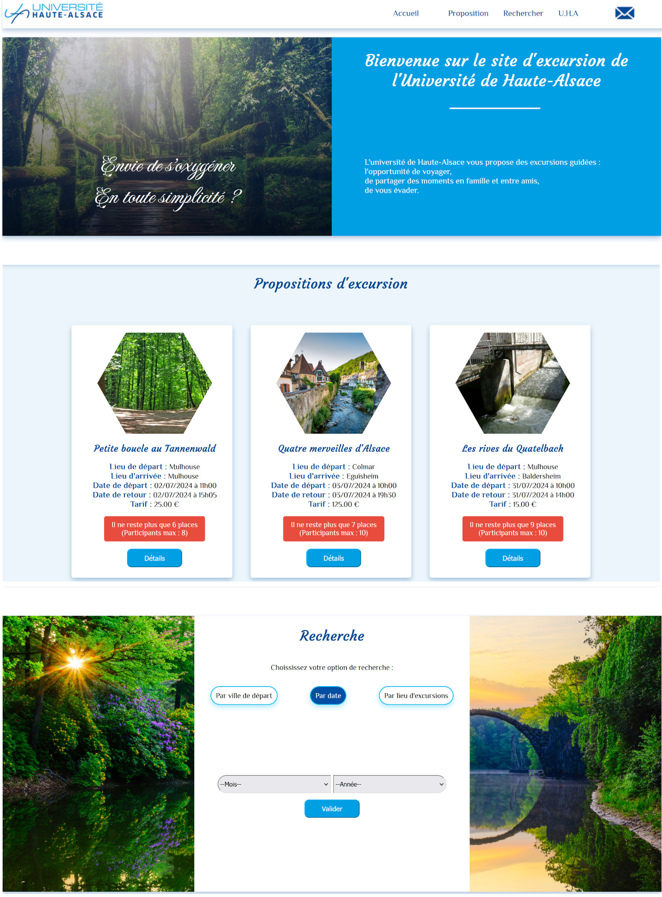
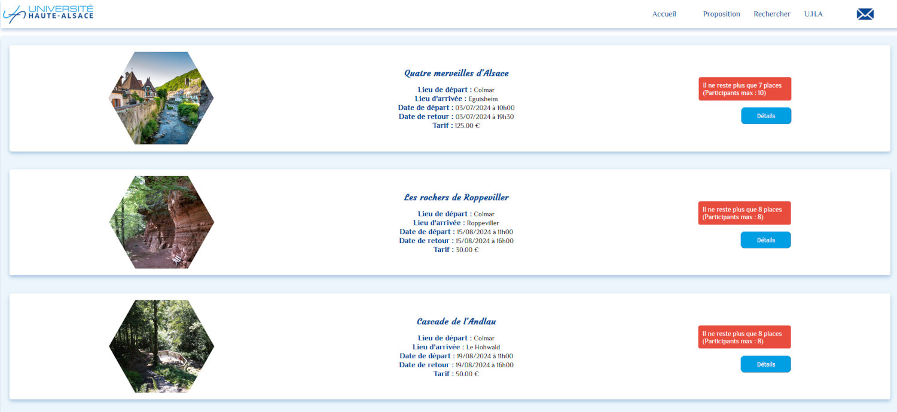
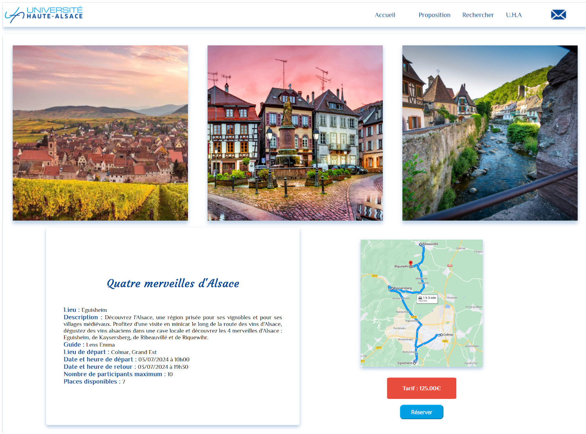

# Site d'excursion

Le site d'excursion est un projet réalisé pour la soutenance validant la Remise A Niveau des métiers du numérique. 
Le but était de mettre en pratique les apprentissages de gestion de projet ainsi que les différents langages appris lors de cette formation de trois mois : HTML, CSS, Javascript, PHP, MySQL.

## Participants et tâches accomplies
Nous avons réalisé ce projet à trois :
- rédaction du cahier des charges
- création de la base de données
- front-end
- back-end
- powerpoint de présentation

## Mon rôle
J'ai endossé le rôle de chef de projet : j'ai organisé le planning et l'avancée du projet.
Nous avons déterminé les différentes fonctionnalités à implanter, en équipe. 
J'ai aidé à la création des scripts SQL de base de données et de celui du contenu.
Je me suis chargée du front-end.

## Langages utilisés
- HTML5
- CSS 3
- Javascript

## Contraintes
- réaliser un site vitrine d'excursions
- créer la base de données à partir de la structure fournie
- possibilté de consulter les excursions (dates, tarifs, nombre de participants, plan du circuit, 3 photos)
- possibilité de s'inscrire à une excursion
- afficher une liste d'excursion en fonction du lieu de départ
- design 3 couleurs

<h2 style="text-align: center;">Images du site</h2>

<h4 style="text-align: center;">Accueil du site :</h4>

 

<h4 style="text-align: center;">Résultat de la recherche :</h4>

<h4 style="text-align: center;">Détails d'une excursion :</h4>

